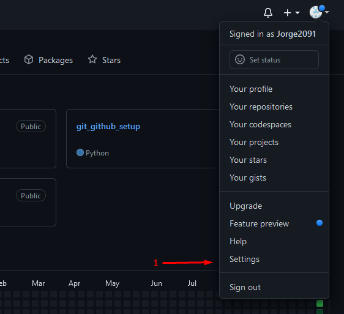
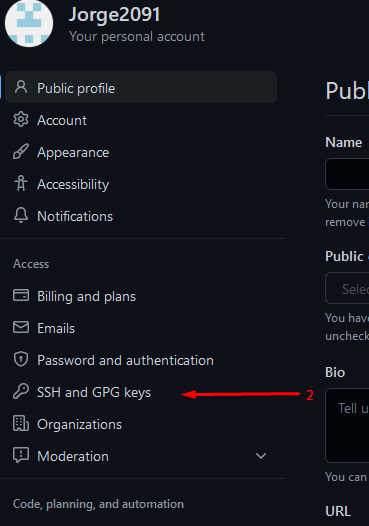
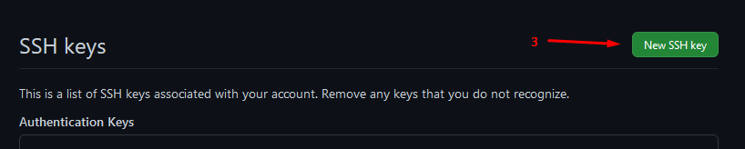

# Intro to ssh


## What is ssh
ssh(secure shell) is a network protocol that gives a secure way for 2 computers to communicated with one another. For this explaining, the two connections will be from local host computer and the GitHub server.
## How to setup ssh

<div></div>
<p> The first step is to download git bash. This can be done using the fallowing link https://git-scm.com/downloads and then choosing your operating system.
git bash is a standalone application that works similar to your shell/terminal.</p>

#### How to find .ssh or create a new folder
1. The location where the .ssh file should be found is usually in /c/Users/`username` where `username` is the name of the user. This can be found in /c/Users.
2. if when typing `cd .ssh` and no directory is found. this is when a new folder can be added using the command line 
```commandline
mkdir .ssh
```
3. once inside .ssh folder, running the command line 
```commandline
ssh-keygen -t ed25519 -C "your_email@example.com"
```
where `your_email@example.com` is the email of your github where you have access to the repository. please note, this is the example code for windows only. if using linux or mac, please click <a href="https://docs.github.com/en/authentication/connecting-to-github-with-ssh/generating-a-new-ssh-key-and-adding-it-to-the-ssh-agent#adding-your-ssh-key-to-the-ssh-agent"> here</a> and choose the correct operating system. <br/>This command will generate a new and unique key for you to use as a secure connection.
4. just press `enter` to all options they may ask such as passphrase or directory as it is not important. 

#### How to connect to GitHub
5. once key is generated, entering the command `ls` and this will show two folder `id_ed25519` as one example. view the second file `id_ed25519.pub` with the command below and copy the key to your clipboard.
```commandline
cat id_ed25519.pub
```
6. On your GitHub account, go to your settings > SSH and GPG keys and click on `New SSH key`

7. Add a title to remember this device as, and make sure you select the option "Authentication Key". Paste the key into the "key" empty box and click "Add SSH key" <br/>
You have now connected to GitHub server and it can now recognise your device with your account. Now the 2 way secure connection between the GitHub server and your device. If you want GitHub to recognise more devices, please redo step 5 to 7.

#### How to commit to GitHub
8. When you create an empty repository, you get command line to connect to your unique repository from your device terminal. Below is a run down of these command line
```commandline
git init
git add README.md
git commit -m "first commit"
git branch -M main
git remote add origin git@github.com:<name.git>
git push -u origin main
```
in the code above, the README.md can be replaced with a " . " to add all folders inside.
in the code above, the <name.git> can be replaced with the name of your repository, this can be find as the title of your repository which is placed on the top left of the page as shown below

